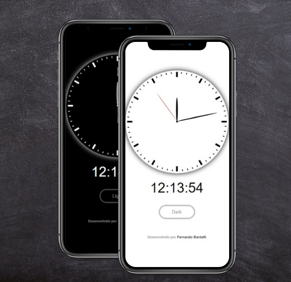

<h1 align="center">Relógio Analógico :clock4:</h1>

<h3>projeto desenvolvido para aplicar conhecimento adquirido em curso, e acrescentar ao portfólio pessoal.</h3>
 
 

<h2 align="center">:speech_balloon:Tabela de conteúdos</h2>
 

    <a href="#sobre">Sobre</a> •
    <a href="#preview">Pré-Visualização</a> •
    <a href="#teste">Teste</a> •
    <a href="#tecnologias">Tecnologias</a> •
    <a href="#contato">Contato</a> •

 
 

    <h1 align="center">Sobre :pencil2:</h1>
     
    Relógio Analógico e digital, mostrando o horário atual. Testando conhecimentos de javascript e css, manipulação de DOM e algumas animações e efeitos no css. Design simples e funcional, com modos escuro(dark/padrão) e claro(light) de acordo com a preferência do usuário.

 
 

    <h1>Pré Visualização</h1>
     
    

    
    

    

    
    

    <h1>Teste :pencil2:</h1>
    
<a href="https://fernandobardelli.github.io/relogio_analogico/" target="_blank">Confira aqui</a>

 
 

    <h1>Tecnologias :computer:</h1>
    
    
    

 
 

    <h1>Contato :email:</h1>
    

    
    <a href="mailto:fernandofelipebardelli@gmail.com" target="_blank">
    
    

